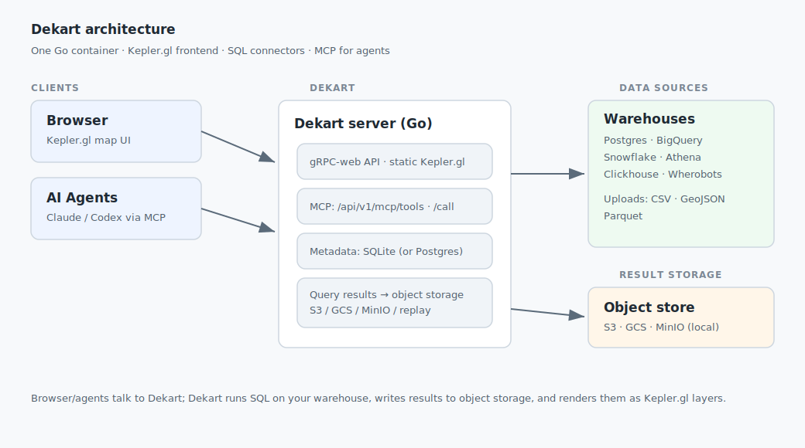
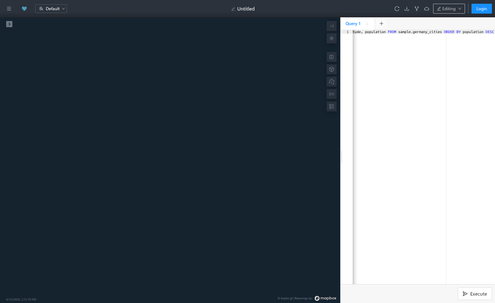
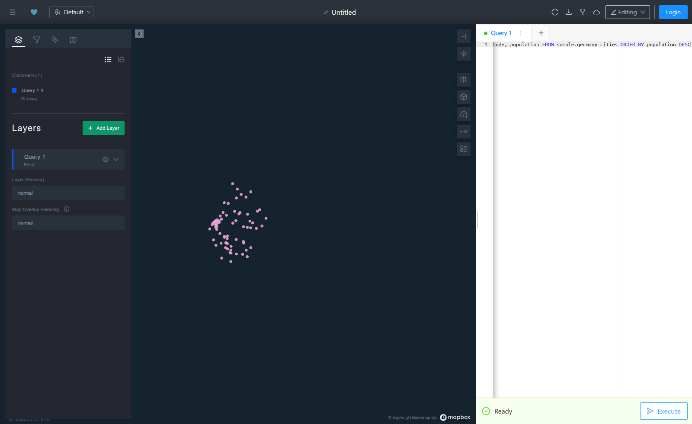
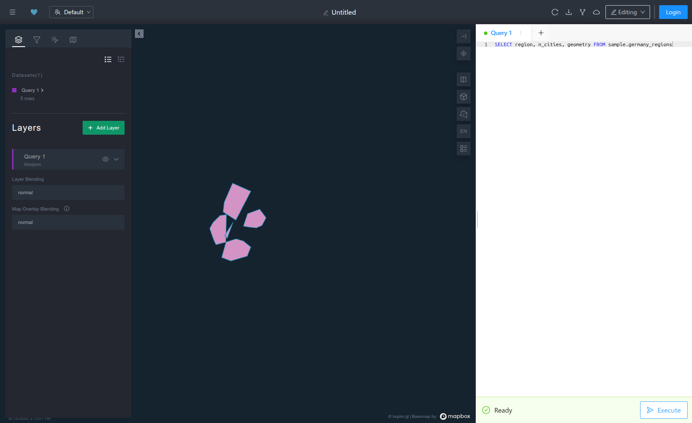
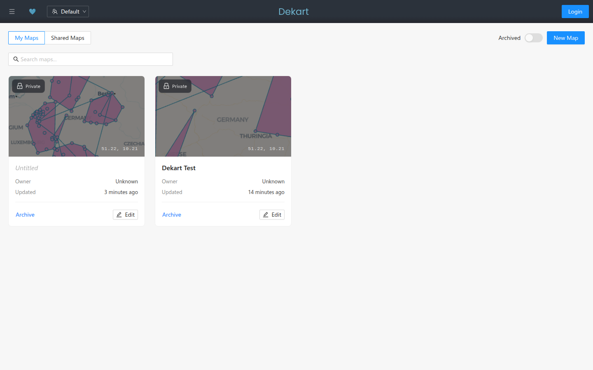

<!-- _class: lead -->
<!-- _paginate: false -->

# Dekart
### Self-hosted backend for **Kepler.gl** — make maps from SQL

Connect a data warehouse · draw geospatial maps · share them · let agents build them

`docker run -p 8080:8080 dekartxyz/dekart`

---

## What is Dekart?

- A **single Go container** that serves a **Kepler.gl** map UI.
- You write **SQL**; Dekart runs it on your warehouse and renders the rows as map layers.
- **Zero-config locally**: built-in SQLite metadata + local/S3 result storage.
- Open source (AGPLv3); commercial licenses for SSO/Postgres metadata.
- Exposes **MCP** so AI agents (Claude / Codex) can build maps for you.

> "Self-hosted alternative to CARTO, Felt and Foursquare Studio for your data warehouse."

---

## Architecture



---

## The map UI



- **Left:** SQL editor (one or more queries per map).
- **Right:** live Kepler.gl map — layers, filters, tooltips, 3D, base map.
- Each query becomes a **dataset → layer**.
- Save, duplicate, share, export.

<!-- footer: Base map tiles need a Mapbox token; data layers render without one. -->

---

## Usage 1 — SQL → points



```sql
SELECT name, state, latitude, longitude, population
FROM sample.germany_cities
ORDER BY population DESC
```

- Kepler auto-detects `latitude` / `longitude`.
- Color & size by any column (here: population).
- Great for POIs, events, sensors, stations.

---

## Usage 2 — lines & polygons



- Select a **GeoJSON** (or WKT) geometry column → path / polygon layers.

```sql
-- polygons
SELECT region, n_cities, geometry
FROM sample.germany_regions
-- lines
SELECT name, distance_km, geometry
FROM sample.germany_lines
```

- Combine points + lines + polygons in **one** layer with a `UNION`, or as **separate** layers in one map.

---

## Possibility — many data sources

| Warehouse | How |
|---|---|
| **Postgres** | `DEKART_DATASOURCE=PG` + connection string |
| **BigQuery** | project + credentials; reads BQ results directly or via GCS |
| **Snowflake** | account / user / key |
| **AWS Athena** | catalog + S3 output |
| **Clickhouse** | connection + S3 output (exports via `s3()`) |
| **Wherobots / Sedona** | spatial SQL |
| **File upload** | CSV · GeoJSON · Parquet |

One instance = one `DATASOURCE`; run **multiple instances** (or USER connections) for several warehouses.

---

## Possibility — result storage

- Query results are stored as objects, then streamed to Kepler.

| Backend | Use |
|---|---|
| **S3 / MinIO** | cloud or **fully local** (MinIO) |
| **GCS** | Google Cloud |
| **Postgres "replay"** | re-runs the query (no bucket) |
| **Snowflake stage** | Snowflake-native |

- Metadata stays on **SQLite** (zero-config) or **Postgres** (license).

---

## Possibility — upload your own data



- Drag-and-drop **CSV / GeoJSON / Parquet** — no warehouse needed.
- Files are stored in your configured object storage.
- Mix uploaded layers with SQL layers on the same map.
- Example shipped: `uploads/germany.geojson` (points + lines + polygons in one file).

---

## Possibility — styling & reuse

- Full Kepler.gl styling: color scales, radius, 3D extrusion, heatmaps, clusters, filters, tooltips.
- Each map's style is **saved** with the report (a Kepler config JSON).
- **Fork / Duplicate** a styled map as a template for new data.
- Custom build adds an **Import style** button → load portable style `.json` files.
- **Snapshots** & public/shared map links for distribution.

---

## Possibility — AI agents (MCP)

- Dekart exposes MCP tools: `list_connections`, `create_query`, `run_query`, `update_report_map_config`, …
- Endpoints: `GET /api/v1/mcp/tools`, `POST /api/v1/mcp/call`.
- Agent client: the **`geosql`** skill for Claude / Codex.

```sh
pip install geosql && geosql        # install the agent skill
pip install dekart-cli && dekart init
```

> Ask Claude: *"Map the 10 biggest German cities, sized by population."* — it writes the SQL and builds the map.

---

## Possibility — deployment & access

- **Run anywhere:** Docker, Docker Compose, AWS ECS (Terraform), Google App Engine.
- **Auth / SSO:** Google OAuth, Keycloak / OIDC, AWS Cognito, Google IAP.
- **Workspaces & roles**, read-only viewers, shared/public maps.
- Reverse-proxy examples included in the repo (`install/docker-compose/`).

---

## This repo — a local playground

`./dekart.sh` runs everything locally (Postgres + MinIO + Dekart):

| Command | Result |
|---|---|
| `up` | Postgres data source → **:8080** |
| `ch` | Clickhouse instance → **:8082** |
| `bq` | BigQuery instance → **:8081** (needs GCP) |
| `build` / `official` | patched image (Import style) ↔ stock |
| `reset` · `logs` · `psql` | data wipe · logs · SQL shell |

Sample data: Denmark POIs + Germany (cities, corridors, region polygons).

---

## Where it fits — use cases

- **Geospatial analytics** on warehouse data without exporting it.
- **Operational dashboards**: deliveries, fleet, stores, coverage.
- **Agent-driven exploration**: Claude builds & iterates maps from prompts.
- **Data QA**: eyeball spatial joins, outliers, coverage gaps.
- **Sharing**: snapshot or share a private map by link.
- **Embedding**: self-hosted maps inside internal tools.

---

<!-- _class: lead -->

# Get started

```sh
git clone https://github.com/rostam/dekart_geo
cd dekart_geo/postgres-example && ./dekart.sh up
# open http://localhost:8080
```

Docs: **dekart.xyz/docs** · Repo: **github.com/dekart-xyz/dekart**

*Built with the local example stack in this repository.*
